# **Fractogenesis: CA vs Conv**
*Fractal structures grown from a single point using Cellular Automata or Convolution Kernels.*

This project explores six experimental fractal generators, all seeded from a minimal state—often just a single cell. Despite their simplicity, these systems produce intricate, emergent patterns by repeatedly applying either discrete cellular automata rules or continuous convolution filters. Some are manually tunable, others evolve using genetic algorithms.

This is a collection of experimental fractal generators based on recursive logic, cellular automata, and convolution. Each module grows complex, often beautiful patterns from a minimal seed — usually a single `1` in a field of zeroes — by applying simple local rules over several iterations.

All demos are browser-based and use only vanilla JavaScript and `<canvas>`.

---

## 🔍 Included Systems

| ID | Folder | Type | Description |
|----|--------|------|-------------|
| 1  | `2d-convolution/`     | 2D Convolution             | Classic 3×3 kernel-based recursive pattern growth |
| 2  | `2d-ca/`              | 2D Cellular Automaton      | 9-bit Moore neighborhood binary CA with random rule logic |
| 3  | `3d-convolution/`     | 3D Convolution             | 3D voxel growth using a 3×3×3 kernel and recursive expansion |
| 4  | `3d-ca/`              | 3D Cellular Automaton      | 3d Moore neighborhood binary CA and recursive padding |
| 5  | `ga-convolution/`     | Convolution + Genetic Algorithm | User selects appealing patterns to evolve convolution kernels |
| 6  | `conv-as-ca/`         | Convolution-as-CA Hybrid   | Mimics classical CA behavior using a 3×3 convolution + activation |

---

## 🚀 How to Run

Open any folder and launch `index.html` in a browser. Each module is standalone and requires no build step or server.

It generates random fractals using a random rule (for CA) or a random kernel (for convolution). Just refresh the page for another random fractal.

---

## 🖼️ Previews

### 2D Cellular Automata
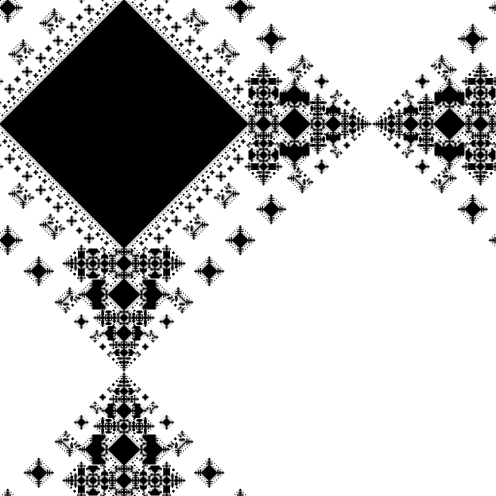

### 2D Convolution

| | | |
|---|---|---|
| 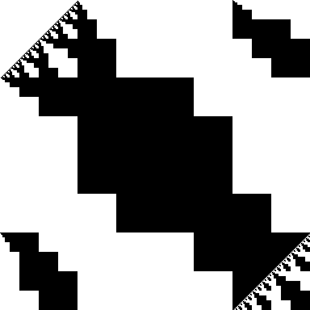 | 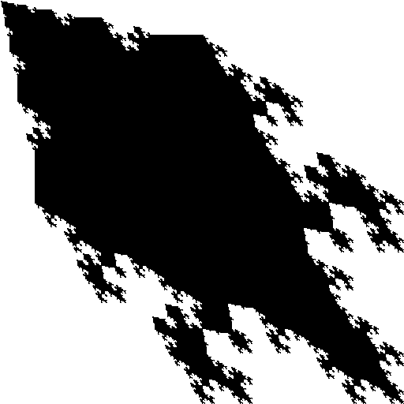 | 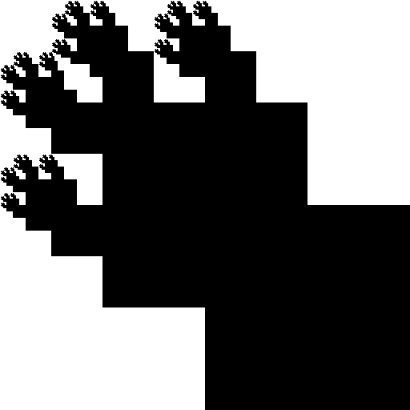 |
| 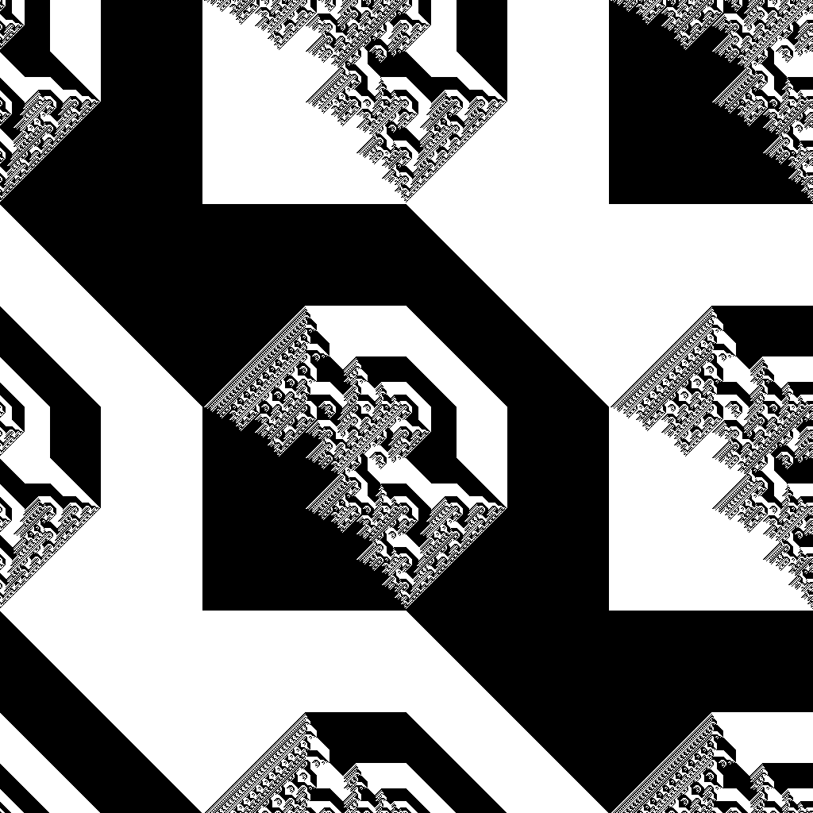 | 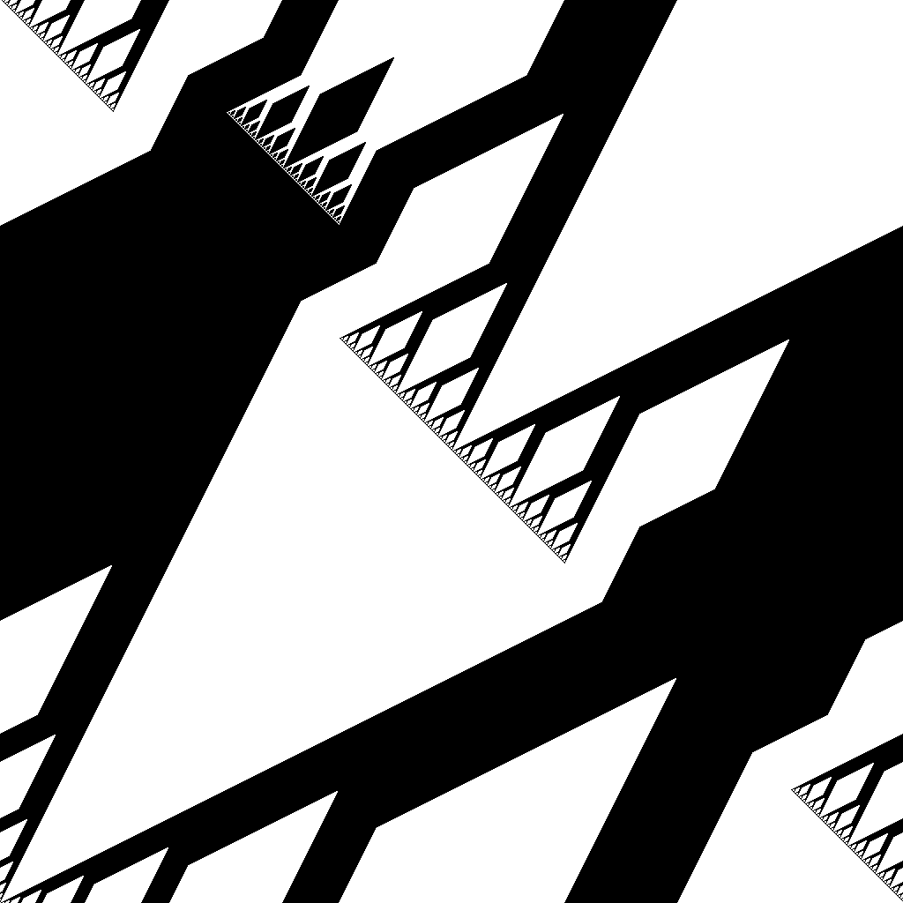 | 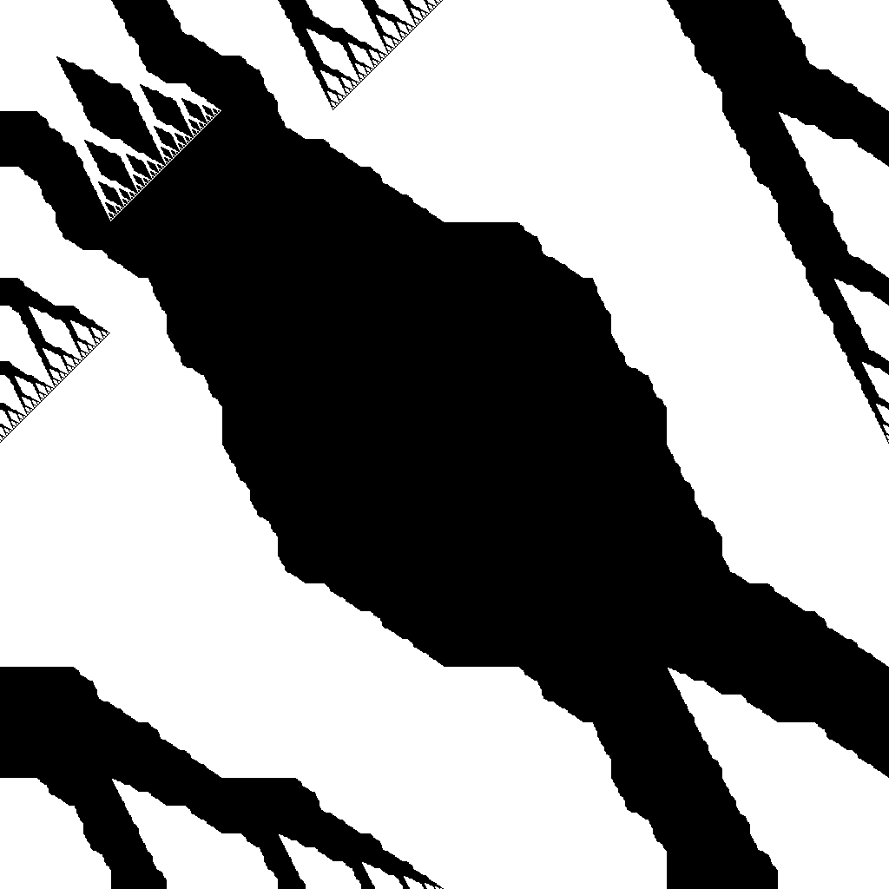 |

### 2D Convolution (different padding)

| | | |
|---|---|---|
| 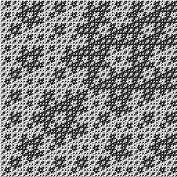 | 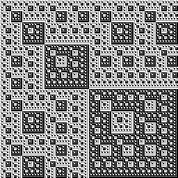 | 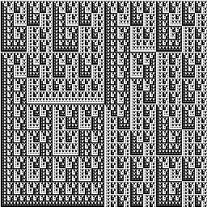 |
| 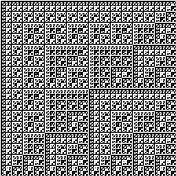 | 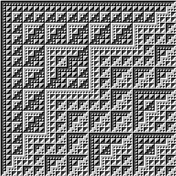 | 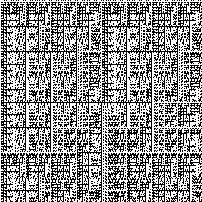 |

### 3D Cellular Automata

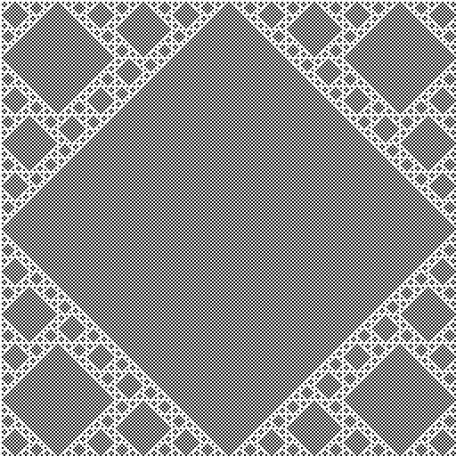

---

## 🧠 Philosophy

This project explores the idea that complexity, structure, and even beauty can emerge from:
- **Recursive local rules**
- **Symbolic vs. numeric logic**
- **Minimal seeds (like a single white pixel)**

It also demonstrates how convolution and cellular automata are two sides of the same coin.

---

## 🧪 Future Work

No way. I'm not going to tell you about my ideas. o_O

---

## 📄 License

MIT License. See [LICENSE](LICENSE) for details.

---

## 👤 Author

Serhii Herasymov  

sergeygerasimofff@gmail.com  

https://github.com/xcontcom
